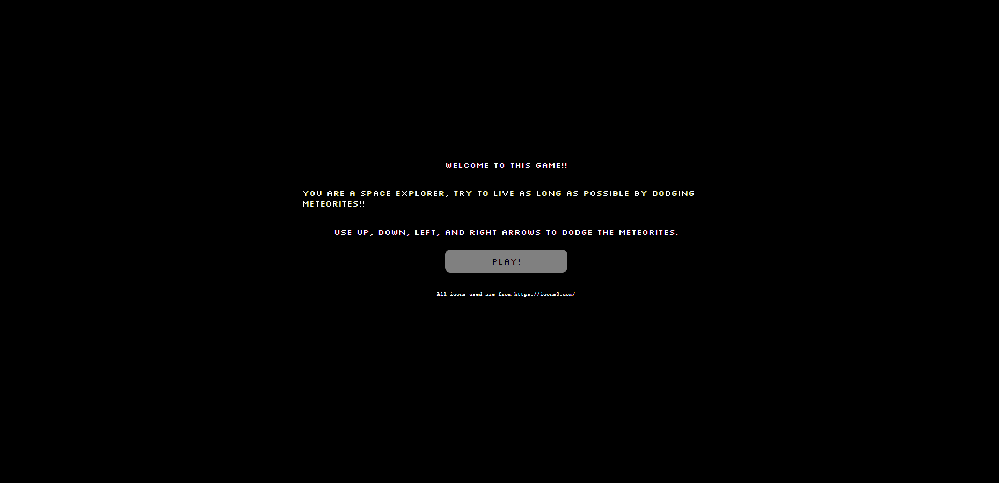

# 👾 Asteroid Dodge (JS Mini-game)

# Demo:

Live: https://andyzhp234.github.io/Into-the-space/

# Game Description:

Asteroid Dodge is an arcade-style game where the player controls a spaceship and must navigate through an asteroid field while avoiding collisions with the rocks. The objective of the game is to survive as long as possible.

# Control:

- W: Move spaceship up
- S: Move spaceship down
- A: Move spaceship left
- D: Move spaceship right

# Screenshots:

 
 

 
 

 
 

# Technologies:

No canvas or WebGL is used

- HTML
- CSS
- Javascript
